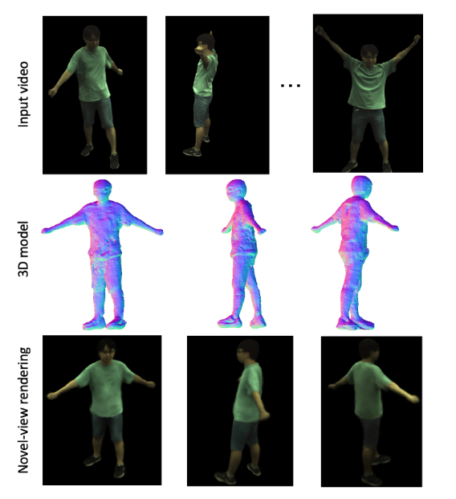
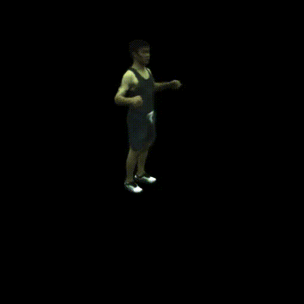
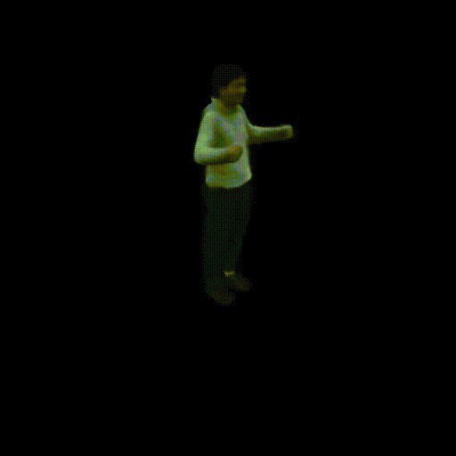

# GHuNeRF: Generalizable Human NeRF from a Monocular Video

Source code for our 3DV 2024 paper GHuNeRF

**About**

This is the source code for the paper

Chen Li, Jiahao Lin, Gim Hee Lee. GHuNeRF: Generalizable Human NeRF from a Monocular Video. In 3DV 2024.

We aim to construct a 3D human NeRF model that can be used to render free-viewpoint images from a monocular video. 

<p align="center">
  
</p>

For more details, please refer to our paper on [arXiv](https://arxiv.org/pdf/2308.16576.pdf).

**Bibtex:**
```
@article{li2023ghunerf,
  title={GHuNeRF: Generalizable Human NeRF from a Monocular Video},
  author={Li, Chen and Lin, Jihao and Lee, Gim Hee},
  journal={arXiv preprint arXiv:2308.16576},
  year={2023}
}
```
**Dependencies**
1. Python 3.8
2. Pytorch 1.9

Please refer to requirements.txt for more details on dependencies. Some dependencies can be installed following [NHP](https://github.com/YoungJoongUNC/Neural_Human_Performer/blob/main/INSTALL.md).

**Data Preprocess**

Please refer to [NHP](https://github.com/YoungJoongUNC/Neural_Human_Performer/blob/main/INSTALL.md) to set up the dataset except that the folder names for new_param and new_vertices do not have to be changed.

Run the command below to write the SMPL parameters of a video sequence into one file, which is more convenient from frame selection.

```
python lib/datasets/light_stage/generate_depth_map.py
```

**Test**

Download [our models](https://drive.google.com/file/d/1yvrZlrSGY5fQe0YeKIcRhCeRkB0osfOz/view?usp=sharing) and put them under the data/trained_model/if_nerf/. Test for the seen identities by running the command below.

```
CUDA_VISIBLE_DEVICES=0 python run.py --type evaluate --cfg_file configs/train_or_eval.yaml test_input_view "7," run_mode test test_mode model_o_motion_o exp_name model_MVT resume True test_sample_cam True test.epoch 400 exp_folder_name testoo time_steps 15 gpus "0," big_box True lbs lbs_new diff_view True norm_th 0.05 bw_refine True camera_embedding True pose_encode True
```
Test for the unseen identities by setting the test_mode to model_x_motion_x and changing the exp_folder_name accordingly. 

Reconstructed meshes can be obtained by running:
```
CUDA_VISIBLE_DEVICES=0 python run.py --type visualize --cfg_file configs/reconstruction.yaml test_input_view "7," test_mode model_o_motion_o exp_name model_MVT resume True test.epoch 400 exp_folder_name testoo time_steps 15 gpus "0," big_box True lbs lbs_new bw_refine True pose_encode True camera_embedding True
```
You can also test our model trained with monocular videos by running:

```
CUDA_VISIBLE_DEVICES=0 python run.py --type evaluate --cfg_file configs/train_or_eval_MoT.yaml test_input_view "7," run_mode test test_mode model_o_motion_o exp_name model_MoT resume True test_sample_cam True test.epoch -1 exp_folder_name testoo time_steps 15 gpus "0," big_box True lbs lbs_new same_view True norm_th 0.05 bw_refine True camera_embedding False pose_encode True
```
**Train**

Train our model for the MVT setting from scratch by running:
```
CUDA_VISIBLE_DEVICES=0 python train_net.py --cfg_file configs/train_or_eval.yaml run_mode train exp_name model_MVT resume True time_steps 15 gpus "0," big_box True lbs lbs_new diff_view True norm_th 0.05 bw_refine True save_freq 50 camera_embedding True pose_encode True
```
or for the MoT setting by running:

```
CUDA_VISIBLE_DEVICES=0 python train_net.py --cfg_file configs/train_or_eval_MoT.yaml run_mode train exp_name GHuNeRF_sameview resume True time_steps 15 gpus "0," big_box True lbs lbs_new diff_view True norm_th 0.05 bw_refine True save_freq 100 camera_embedding False pose_encode True train.epoch 700
```

**Results**

Novel view synthesis results for both seen and unseen identities on the ZJU-MoCap dataset.
<p align="center">
  
   
   
</p>

More results on 3D reconstruction.
<p align="center">
  
   
   
</p>


**Acknowledgements**

Some codes are directly adopted from [NHP](https://github.com/YoungJoongUNC/Neural_Human_Performer). Please also cite their paper if you use the codebase.
